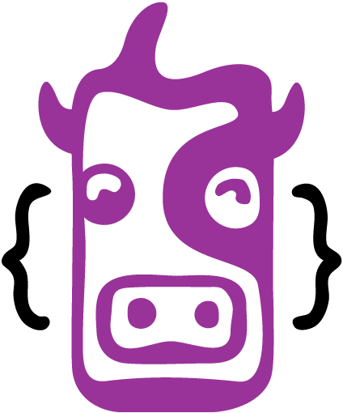

cowlick
=======

_Templating languages don't get the attention they deserve._

Cowlick is an
HTML templating language,
implemented in Javascript —
and designed to facilitate
clarity, maintainability, organization,
and real-time rendering performance
for hypertext markup.

Vision
------

Cowlick is not opinionated about how you write markup,
or what markup you write, so long as it is valid.
We do have very strong opinions
about what makes a good templating language:

1. Compiles to abstract DOM objects,
   that can be diffed and rendered
   by tools like [React] or [Virtual DOM].
2. Provides a superset of (strict) HTML,
   so that well-structured markup
   is valid Cowlick.
3. Provides programatic controls
   (variables, functions, conditionals, loops, etc)
   that allow for smart templating
   and organized, reusable components.
4. Provides a readable markup-style syntax
   that makes DOM structures clear and maintainable.
5. Provides a clear differentiation
   between HTML and non-HTML syntax.
5. Provides warnings and errors
   for poorly-structured markup.

[React]: https://facebook.github.io/react/
[Virtual DOM]: https://github.com/Matt-Esch/virtual-dom

Inspiration
-----------

At this point,
[Jinja2] (Python) and [Nunjucks] (JS)
provide our favorite syntax
with clear divisions between HTML
and template controls.

Compiling to the DOM will require
more strictly-formed markup,
and may require additional controls.
Cowlick is not meant to be a direct port,
but will be heavily inspired by Jinja2.

We are also inspired
by the language design of [Sass] —
which respects the separation of concerns,
while providing on-demand power-tools
to users who already understand the core language.

[React] is an inspiring example
of virtual-DOM diffing and rendering —
and provides some much-needed food-for-thought
around component architecture —
but JSX does not meet any of our other specifications
for well-formed markup templates.

[Jinja2]: http://jinja.pocoo.org/docs/dev/
[Nunjucks]: https://mozilla.github.io/nunjucks/
[Sass]: http://sass-lang.com/
